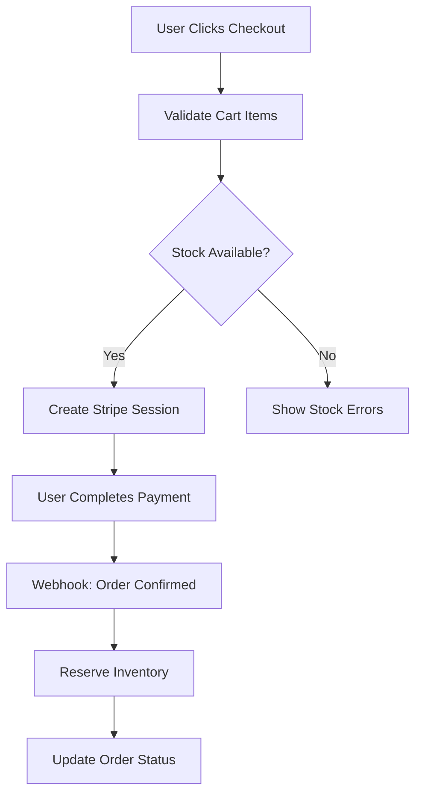

# Inventory Management System

This document outlines the comprehensive inventory management system implemented for the ZM Deals e-commerce platform.

## Overview

The inventory management system provides real-time stock tracking, validation, and updates throughout the entire checkout flow. It ensures that customers cannot purchase items that are out of stock and automatically manages inventory levels when orders are placed or cancelled.

## Key Features

### 1. Real-time Stock Validation
- **Cart Validation**: Stock availability is checked when items are added to cart or quantities are updated
- **Checkout Validation**: Final stock validation occurs before checkout to prevent overselling
- **Dynamic Updates**: Stock levels are updated in real-time as orders are processed

### 2. Inventory Reservation System
- **Stock Reservation**: Inventory is reserved when orders are confirmed (payment successful)
- **Stock Release**: Reserved inventory is released when orders are cancelled or payment fails
- **Transaction Safety**: All inventory operations use database transactions for data consistency

### 3. Comprehensive Monitoring
- **Low Stock Alerts**: Products with less than 10 items trigger low stock warnings
- **Out of Stock Tracking**: Automatic detection and management of out-of-stock products
- **Inventory Dashboard**: Admin interface for monitoring and managing inventory levels

## System Architecture

### Core Components

#### 1. Inventory Module (`src/modules/inventory/`)
```
inventory/
├── actions/
│   └── mutation.ts          # Inventory management functions
├── components/
│   └── inventory-dashboard.tsx  # Admin dashboard component
└── types/
    └── index.ts             # Type definitions
```

#### 2. Database Schema (`src/server/schema/inventory-schema.ts`)
```sql
CREATE TABLE inventory (
  id UUID PRIMARY KEY,
  product_id UUID REFERENCES products(id),
  stock INTEGER NOT NULL DEFAULT 0,
  initial_stock INTEGER NOT NULL DEFAULT 0,
  is_out_of_stock BOOLEAN NOT NULL DEFAULT false,
  created_at TIMESTAMP,
  updated_at TIMESTAMP
);
```

### Key Functions

#### Stock Validation
```typescript
validateStockAvailability(items: Array<{productId: string, quantity: number}>)
```
- Validates if requested quantities are available
- Returns detailed error messages for each product
- Used throughout the checkout flow

#### Stock Reservation
```typescript
reserveStock(items: Array<{productId: string, quantity: number}>, orderId: string)
```
- Decreases inventory when orders are confirmed
- Uses database transactions for safety
- Called after successful payment processing

#### Stock Release
```typescript
releaseStock(items: Array<{productId: string, quantity: number}>, orderId: string)
```
- Increases inventory when orders are cancelled
- Handles payment failures and order cancellations
- Restores stock to previous levels

## Checkout Flow Integration

### 1. Cart Management
- **Add to Cart**: Stock validation before adding items
- **Quantity Updates**: Real-time validation of new quantities
- **Cart Summary**: Displays stock errors and prevents checkout

### 2. Checkout Process


### 3. Payment Processing
- **Success**: Inventory is reserved and order is confirmed
- **Failure**: Inventory is released and order is cancelled
- **Cancellation**: Inventory is released and order is cancelled

## Webhook Integration

### Stripe Webhooks
The system handles various Stripe webhook events:

#### Checkout Session Completed
```typescript
handleCheckoutSessionCompleted(session, sessionId)
```
- Creates order in database
- Confirms order and reserves inventory
- Clears user's cart

#### Payment Intent Failed
```typescript
handlePaymentIntentFailed(paymentIntent)
```
- Updates order status to failed
- Releases reserved inventory
- Logs failure details

#### Payment Intent Cancelled
```typescript
handlePaymentIntentCanceled(paymentIntent)
```
- Cancels order
- Releases reserved inventory
- Handles user cancellations

## Admin Dashboard

### Inventory Dashboard Features
- **Real-time Monitoring**: Live view of stock levels
- **Low Stock Alerts**: Products requiring attention
- **Out of Stock Management**: Products needing restocking
- **Bulk Updates**: Quick stock adjustments
- **Historical Tracking**: Stock level changes over time

### Dashboard Components
```typescript
<InventoryDashboard />
```
- Displays low stock products (< 10 items)
- Shows out of stock products
- Provides stock update functionality
- Real-time refresh capabilities

## Error Handling

### Stock Validation Errors
- **Out of Stock**: Product has no available inventory
- **Insufficient Stock**: Requested quantity exceeds available stock
- **Product Not Found**: Product doesn't exist in inventory

### Error Recovery
- **Failed Reservations**: Automatic retry mechanisms
- **Partial Failures**: Graceful degradation
- **Data Consistency**: Transaction rollback on failures

## Performance Considerations

### Optimization Strategies
- **Database Indexes**: Optimized queries for inventory lookups
- **Caching**: Frequently accessed inventory data
- **Batch Operations**: Bulk inventory updates
- **Async Processing**: Non-blocking inventory operations

### Monitoring
- **Stock Alerts**: Automated notifications for low stock
- **Performance Metrics**: Response times and throughput
- **Error Tracking**: Comprehensive error logging

## Security

### Access Control
- **Admin Only**: Inventory management restricted to authorized users
- **Session Validation**: Secure authentication for all operations
- **Audit Trail**: Complete history of inventory changes

### Data Integrity
- **Transaction Safety**: ACID compliance for all operations
- **Validation**: Input validation and sanitization
- **Idempotency**: Safe retry mechanisms for webhooks

## Usage Examples

### Adding Items to Cart
```typescript
const result = await addToCart(productId, quantity);
if (!result.success) {
  // Handle stock validation error
  console.error(result.error);
}
```

### Checking Stock Availability
```typescript
const validation = await validateStockAvailability([
  { productId: "123", quantity: 2 }
]);
if (!validation.isValid) {
  // Handle validation errors
  validation.errors.forEach(error => {
    console.error(`${error.productTitle}: ${error.error}`);
  });
}
```

### Updating Inventory
```typescript
const result = await updateProductInventory(productId, newStock);
if (result.success) {
  console.log("Inventory updated successfully");
}
```

## Best Practices

### Development
1. **Always validate stock** before allowing cart additions
2. **Use transactions** for inventory updates
3. **Handle edge cases** like concurrent purchases
4. **Log all inventory changes** for audit purposes

### Operations
1. **Monitor low stock alerts** regularly
2. **Set up automated notifications** for critical stock levels
3. **Review inventory reports** periodically
4. **Maintain accurate initial stock** values

### Testing
1. **Test concurrent purchases** to ensure data consistency
2. **Verify webhook handling** for all payment scenarios
3. **Test inventory recovery** after order cancellations
4. **Validate error handling** for edge cases

## Troubleshooting

### Common Issues

#### Stock Not Updating
- Check webhook delivery status
- Verify database transaction logs
- Ensure proper error handling

#### Duplicate Reservations
- Check for duplicate webhook events
- Verify idempotency implementation
- Review order status transitions

#### Performance Issues
- Monitor database query performance
- Check for missing indexes
- Review caching strategies

### Debug Tools
- **Webhook Logs**: Stripe webhook delivery status
- **Database Logs**: Transaction and query logs
- **Application Logs**: Detailed error tracking
- **Inventory Dashboard**: Real-time stock monitoring

## Future Enhancements

### Planned Features
- **Automated Reordering**: Automatic purchase orders for low stock
- **Supplier Integration**: Direct supplier inventory sync
- **Advanced Analytics**: Stock turnover and demand forecasting
- **Multi-location Support**: Multiple warehouse inventory management

### Scalability Improvements
- **Event Sourcing**: Event-driven inventory updates
- **Microservices**: Separate inventory service
- **Real-time Sync**: WebSocket-based live updates
- **Advanced Caching**: Redis-based inventory cache

## Conclusion

The inventory management system provides a robust, scalable solution for managing product stock levels throughout the e-commerce platform. It ensures data consistency, prevents overselling, and provides comprehensive monitoring capabilities for efficient inventory management. 